<a name="T_1F5715D5"></a>
# <span style="color:rgb(213,80,0)">Using plotBrain.m</span>
<a name="beginToc"></a>
## Table of Contents
[Prelims](#H_BA3E0F0C)
 
[Plotting One Brain Surface](#H_203DEBD4)
 
&emsp;[Introduction](#H_A2D01B5D)
 
&emsp;[More Options (using Name-Value Arguments)](#H_99FAE2DD)
 
[Plotting Multiple Brain Maps](#H_F93E98DD)
 
&emsp;[Changing only the data map](#H_AE42F711)
 
&emsp;[Changing only the parcellation](#H_3236C9D1)
 
&emsp;[Changing only the view](#H_27409577)
 
&emsp;[Changing the data map and the parcellation](#H_040A701F)
 
&emsp;[Changing the shape of the grid](#H_62639061)
 
[Plotting Two Hemispheres](#H_7BA7FBCE)
 
[Plotting Multiple Data Maps and Views](#H_400D68F1)
 
&emsp;[Groupings](#H_BFE4F4ED)
 
[Colorschemes and Colorbars](#H_2D9A5493)
 
[Titles](#H_6480F150)
 
[Combining into Larger Figures](#H_03317DF2)
 
<a name="endToc"></a>
<a name="H_BA3E0F0C"></a>
# Prelims
-  If not already installed, please install **plotSurfaceROIBoundary** (originally written by Stuart Oldham) from [here](https://github.com/magnesium2400/plotSurfaceROIBoundary), [here](https://github.com/StuartJO/plotSurfaceROIBoundary), or [here](https://github.com/StuartJO/BrainSurfaceAnimation)  
-  Please load data containing surface information (vertices and faces) and parcellations (e.g. from the DATA or examples folders) 
```matlab
if ~exist('lh_verts', 'var'); try lh_verts = lh_verts_midthickness; catch; end; end
```
<a name="H_203DEBD4"></a>
# Plotting One Brain Surface
<a name="H_A2D01B5D"></a>
## Introduction

The simplest way to using plotBrain.m requires: 

-  Vertices and faces of the surface to be plotted (either in a struct, or in two separate variables) 
-  A parcellation (This can be replaced with a column of 1's and 0's to denote vertices to be included or excluded, without specifying ROI boundaries) 
-  Data to be plotted - at either vertex resolution or parcel resolution 

Note that parcels with the label 0 will be colored grey (e.g. the medial wall).


A few examples are as follows:

```matlab
% Parcelled data, plotted in each parcel
% Check the size and shape of each input
figure; plotBrain(lh_verts, lh_faces, Scha17_parcs.lh_scha100, (1:50).');
```

<center>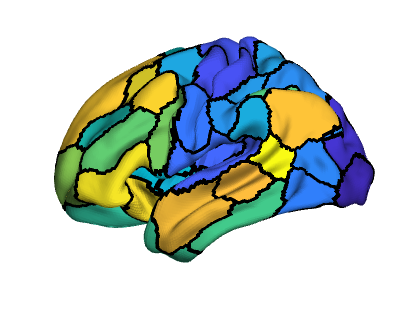</center>


```matlab

% Unparcellated data (i.e. dense vertex-level data), plotted with ROI boundaries
figure; plotBrain(lh_verts, lh_faces, Scha17_parcs.lh_scha100, lh_verts(:,2));
```

<center>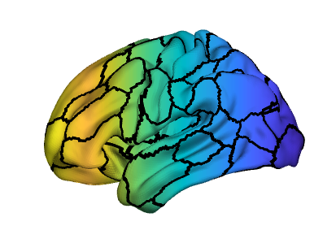</center>


```matlab

% Unparcellated data (i.e. dense vertex-level data), plotted without ROI boundaries
figure; plotBrain(lh_verts, lh_faces, logical(Scha17_parcs.lh_scha100), lh_verts(:,2));
```

<center></center>


```matlab

% Display data in the medial wall too
figure; plotBrain(lh_verts, lh_faces, ones(size(lh_verts, 1), 1), lh_verts(:,2));
```

<center>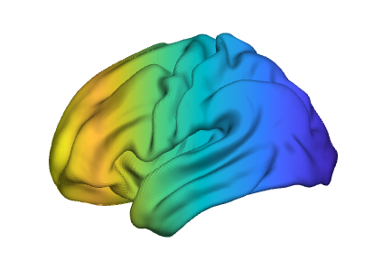</center>


```matlab

% You can also input a struct instead of two matrices
brainSurface = struct('vertices', lh_verts, 'faces', lh_faces);
figure; plotBrain(brainSurface, ones(size(lh_verts, 1), 1), lh_verts(:,2));
```

<center></center>


When used in this way, plotBrain is a wrapper for <samp>patchp</samp>. Have a look at the examples and documentation for more uses of this function, including how to plot data for only certain ROIs. 

<a name="H_99FAE2DD"></a>
## More Options (using Name-Value Arguments)

plotBrain also contains name-value inputs that aid in modifying the appearance of the figure. Some examples are below:

```matlab
% Change the view to left medial ('lm')
figure; plotBrain(lh_verts, lh_faces, Scha17_parcs.lh_scha100, (1:50).' - 25, 'view', 'lm');
```

<center>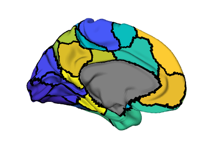</center>


```matlab

% Change the colormap
% Note that diverging/dynamic colormaps must be specified as function handles
figure; plotBrain(lh_verts, lh_faces, Scha17_parcs.lh_scha100, (1:50).' - 25, 'colormap', cool); colorbar;
```

<center>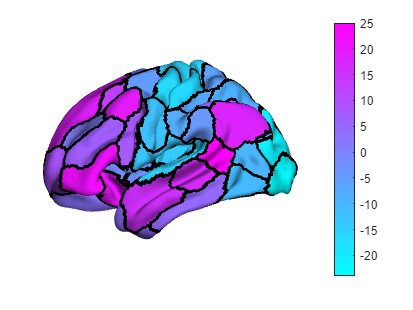</center>


```matlab
figure; plotBrain(lh_verts, lh_faces, Scha17_parcs.lh_scha100, (1:50).' - 25, 'colormap', @bluewhitered); colorbar;
```

<center>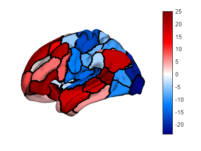</center>


```matlab
figure; plotBrain(lh_verts, lh_faces, Scha17_parcs.lh_scha100, (1:50).' - 25, 'colormap', jet(5)); colorbar;
```

<center>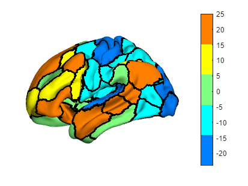</center>


```matlab

% Truncate the colormap limits - compare with above map
figure; plotBrain(lh_verts, lh_faces, Scha17_parcs.lh_scha100, (1:50).' - 25, ...
    'colormap', jet(5), 'clim', [-10 10]); colorbar;
```

<center>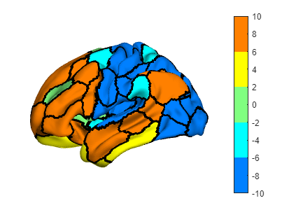</center>

<a name="H_F93E98DD"></a>
# Plotting Multiple Brain Maps

Out of the box, plotBrain also includes support for plotting more than one brain at a time (using <samp>tiledlayout</samp>). 

<a name="H_AE42F711"></a>
## Changing only the data map

You can plot more than one brain map at a time by changing your data input from a column vector to a matrix:

```matlab
figure; plotBrain(lh_verts, lh_faces, Scha17_parcs.lh_scha100, rand(50, 4));
```

<center>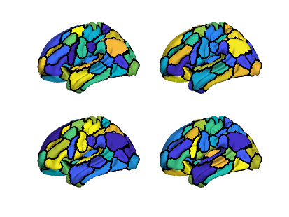</center>

<a name="H_3236C9D1"></a>
## Changing only the parcellation

You can plot more than one parcellation at a time by changing the <samp>rois</samp> input (with data at the vertex level):

```matlab
figure; plotBrain(lh_verts, lh_faces, ...
    [Scha17_parcs.lh_scha100, Scha17_parcs.lh_scha200, Scha17_parcs.lh_scha300, Scha17_parcs.lh_scha400], ...
    lh_verts(:,2)+lh_verts(:,3));
```

<center>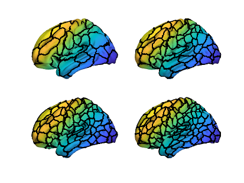</center>

<a name="H_27409577"></a>
## Changing only the view

You can change the view using the <samp>'view'</samp> Name-Value argument: the input should be a cell array consisting of either camera angles, or the keyphrases  <samp>'ll'/'lm'/'rl'/'rm'</samp> (left/right lateral/medial), or a combination. 

```matlab
figure; plotBrain(lh_verts, lh_faces, Scha17_parcs.lh_scha100, rand(50, 1), ...
    'view', {[0 0], 'll', [180 0], 'lm'});
```

<center>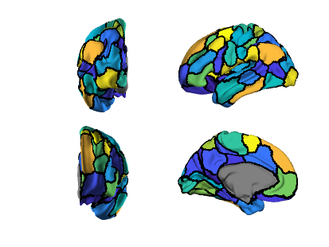</center>


```matlab
figure; plotBrain(lh_verts, lh_faces, Scha17_parcs.lh_scha100, rand(50, 1), ...
    'view', { [-135 0], [-45 0], [45 0], [135 0]});
```

<center>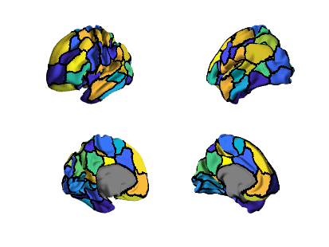</center>

<a name="H_040A701F"></a>
## Changing the data map and the parcellation

If there are multiple parcellations and data maps provided, these will be simultaneously varied. Note that if you are providing multiple data maps at different parcellation resolutions, this will have to be as a cell arrray.

```matlab
figure; plotBrain(lh_verts, lh_faces, ...
    {Scha17_parcs.lh_scha100, Scha17_parcs.lh_scha200, Scha17_parcs.lh_scha300, Scha17_parcs.lh_scha400}, ...
    {(1:50).', (1:100).', (1:150).', (1:200).'});
```

<center>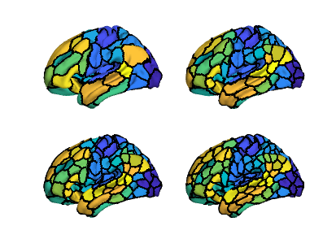</center>

<a name="H_62639061"></a>
## Changing the shape of the grid

Grids are constructed using <samp>tiledlayout</samp>. The default input when <samp>tiledlayout</samp> is called is the argument <samp>'flow'</samp>. However, this can be changed using the name-value argument  <samp>'tiledlayoutOptions'</samp> in plotBrain:

```matlab
% Compare the two figures:
figure; plotBrain(lh_verts, lh_faces, Scha17_parcs.lh_scha100, rand(50, 4));
```

<center>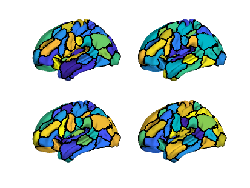</center>


```matlab
figure; plotBrain(lh_verts, lh_faces, Scha17_parcs.lh_scha100, rand(50, 4), 'tiledlayoutOptions', {1, 4});
```

<center>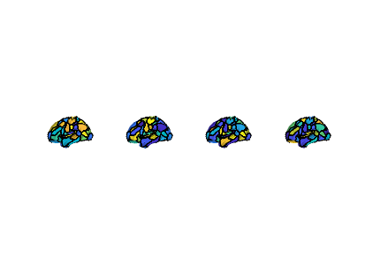</center>


The tiledlayout object can also be accessed (as an output argument) and modified e.g. to add titles.

```matlab
figure; [~,~,tl] = plotBrain(lh_verts, lh_faces, Scha17_parcs.lh_scha100, rand(50, 1), ...
    'view', {'ll', [-45 0], [45 0], 'lm'}, 'tiledlayoutOptions', {4, 1, 'TileSpacing', 'loose'});
for ii = 1:4
    title(nexttile(tl, ii), sprintf("View %d", ii));
end
```

<center>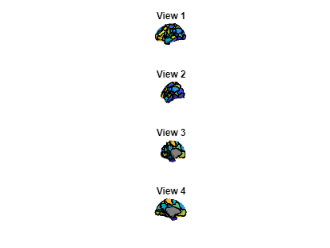</center>

<a name="H_7BA7FBCE"></a>
# Plotting Two Hemispheres
<a name="H_09FF8078"></a>

To plot two hemispheres, input the verts, faces, rois, and data for each hemisphere in two seperate cell arrays: 

```matlab
figure; 
plotBrain('lh', {lh_verts, lh_faces, Scha7_parcs.lh_scha100, rand(50,1)}, ...
    'rh', {rh_verts, rh_faces, Scha7_parcs.rh_scha100, rand(50,1)});
```

<center>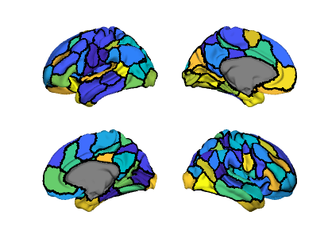</center>


By default, this plots in the order ll-lm-rm-rl. This can be changed easily: 

```matlab
figure; 
plotBrain('lh', {lh_verts, lh_faces, Scha7_parcs.lh_scha100, rand(50,1)}, ...
    'rh', {rh_verts, rh_faces, Scha7_parcs.rh_scha100, rand(50,1)}, ...
    'viewOrder', {'ll', 'lm', 'rl', 'rm'});
```

<center>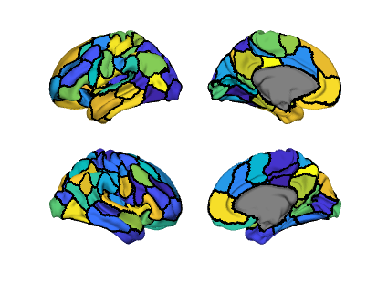</center>


<a name="H_400D68F1"></a>
# Plotting Multiple Data Maps and Views

If you supply multiple maps/parcellations and multiple input to the <samp>'view'</samp> argument, this will automatically produce a grid of brains (using <samp>tiledlayout</samp>) with each combination of map and view plotted.


By default, datasets will change as you move down columns, and views will change as you move across rows 


This can be changed by using using the name-value argument <samp>'tiledlayoutOptions'</samp> and the suboption <samp>'TileIndexing'</samp>.

```matlab
% 4 datasets, 2 views
figure; plotBrain(lh_verts, lh_faces, Scha17_parcs.lh_scha100, (1:50).'+(-37.5:12.5:0), 'colormap', @bluewhitered, 'view', {[-90 0], [90 0]}, 'tiledlayoutOptions', {4, 2});
```

<center>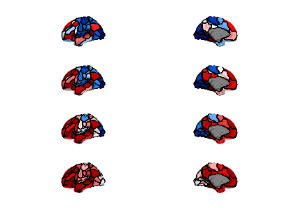</center>


```matlab
figure; plotBrain(lh_verts, lh_faces, Scha17_parcs.lh_scha100, (1:50).'+(-37.5:12.5:0), 'colormap', @bluewhitered, 'view', {[-90 0], [90 0]}, 'tiledlayoutOptions', {2, 4, 'TileSpacing', 'none', 'TileIndexing', 'columnmajor'});
```

<center>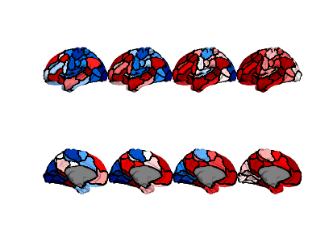</center>


```matlab

% 2 datasets, 4 views
figure; plotBrain(lh_verts, lh_faces, Scha17_parcs.lh_scha100, (1:50).'+(-25:25:0), 'colormap', @bluewhitered, 'view', {[-90 0], [-45 0], [45 0], [90 0]}, 'tiledlayoutOptions', {2, 4});
```

<center>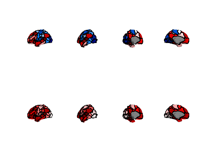</center>


```matlab
figure; plotBrain(lh_verts, lh_faces, Scha17_parcs.lh_scha100, (1:50).'+(-25:25:0), 'colormap', @bluewhitered, 'view', {[-90 0], [-45 0], [45 0], [90 0]}, 'tiledlayoutOptions', {4, 2, 'TileSpacing', 'none', 'TileIndexing', 'columnmajor'});
```

<center>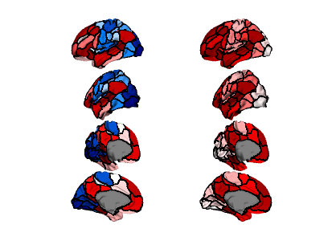</center>


```matlab

% Plot all maps in one row
figure; plotBrain(lh_verts, lh_faces, Scha17_parcs.lh_scha100, (1:50).'+(-37.5:12.5:0), 'colormap', @bluewhitered, 'view', {[-90 0], [90 0]}, 'tiledlayoutOptions', {1, 8, 'TileSpacing', 'none'});
```

<center>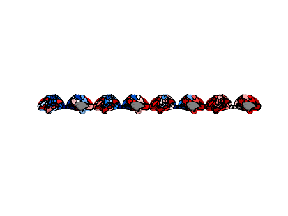</center>


```matlab
% More examples of column major indexing
% 5 datasets, 3 views
figure; [~,~,tl]=plotBrain(lh_verts, lh_faces, Scha17_parcs.lh_scha100, (1:50).'+(-50:12.5:0), 'colormap', @bluewhitered, ...
    'view', {[-90 0], [0 0], [90 0]}, 'tiledlayoutOptions', {5, 3, 'TileSpacing', 'none',});
title(tl, 'Default (TileIndexing = rowmajor)');
xlabel(tl, 'View changes');
ylabel(tl, 'Map changes');
```

<center>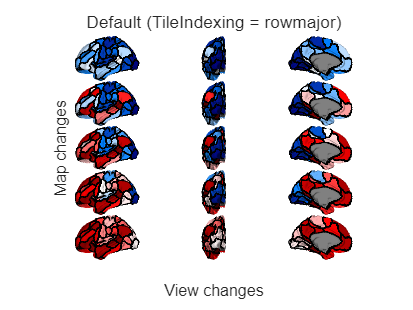</center>


```matlab

figure; [~,~,tl]=plotBrain(lh_verts, lh_faces, Scha17_parcs.lh_scha100, (1:50).'+(-50:12.5:0), 'colormap', @bluewhitered, ...
    'view', {[-90 0], [0 0], [90 0]}, 'tiledlayoutOptions', {3, 5, 'TileSpacing', 'none', 'TileIndexing', 'columnmajor'});
title(tl, 'Changed (TileIndexing = columnmajor)');
xlabel(tl, 'Map changes');
ylabel(tl, 'View changes');
```

<center>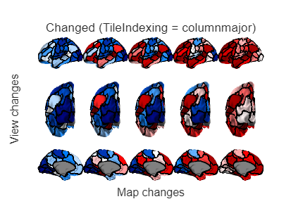</center>

<a name="H_BFE4F4ED"></a>
## Groupings

If using the syntax above, each map/view will be plotted on its own tile in the <samp>tiledlayout</samp> object.


However, you can also choose to group each map or each view together. This is useful for adding titles and colorbars to the figures. 


Instead of generating \texttt{nData * nViews} tiles (which is the default), when the <samp>'groupBy'</samp>argument is set to <samp>'data', nData</samp>  tiles are generated. Each of these is it itself a <samp>tiledlayout</samp>, with <samp>nView</samp> tiles in it. 


These subtiles can also be accessed as an output argument of plotBrain.

```matlab
% Compare the following examples: 
% Plot all maps in one row
figure; [~,~,tl] = plotBrain(lh_verts, lh_faces, Scha17_parcs.lh_scha100, (1:50).'+(-37.5:12.5:0), 'colormap', @bluewhitered, ...
    'view', {[-90 0], [90 0]}, 'tiledlayoutOptions', {1, 8, 'TileSpacing', 'none'});
for ii = 1:8; title(nexttile(tl, ii), sprintf("Map %d", ii)); end
```

<center>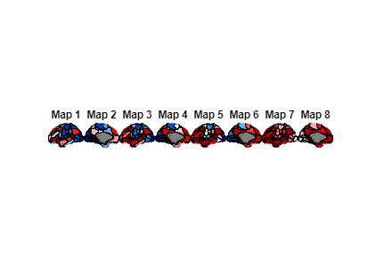</center>


```matlab

% Use groupBy data
figure; [~,~,tl,tl2] = plotBrain(lh_verts, lh_faces, Scha17_parcs.lh_scha100, (1:50).'+(-37.5:12.5:0), 'colormap', @bluewhitered, ...
    'view', {[-90 0], [90 0]}, 'tiledlayoutOptions', {'flow', 'TileSpacing', 'compact'}, 'groupBy', 'data', 'titles', {'Map 1', 'Map 2', 'Map 3', 'Map 4'}); %#ok<*ASGLU> 
title(tl, 'groupBy data');
```

<center>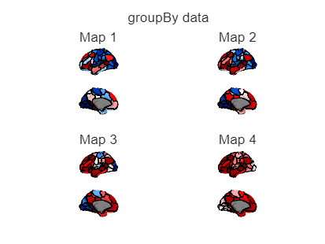</center>


```matlab
% Try popping out this figure and adjusting the size
```

The other alternative is <samp>'groupBy', 'view'</samp>, if desired.

<a name="H_2D9A5493"></a>
# Colorschemes and Colorbars

You can add a colorbar to each group by using the <samp>'colorbarOn'</samp> argument. 


You can also set all maps to use the same color limits using <samp>'colorscheme', 'global'</samp>.

```matlab
%%% regular colormaps
% each map plotted on its own colorspace and its own colorbar 
figure; plotBrain(lh_verts, lh_faces, Scha17_parcs.lh_scha100, 50*rand(50, 9)+(-75:12.5:25), 'colormap', cool(100), 'colorbarOn', true);
```

<center>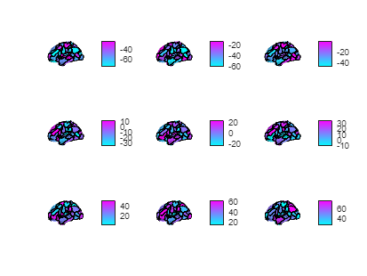</center>


```matlab
% each map plotted in a global colorscheme, with one global colorbar
figure; plotBrain(lh_verts, lh_faces, Scha17_parcs.lh_scha100, 50*rand(50, 9)+(-75:12.5:25), 'colorscheme', 'global'); c = colorbar; c.Layout.Tile = 'east'; 
```

<center>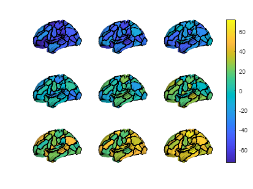</center>


```matlab

%% diverging colormaps specified as function handle
figure; plotBrain(lh_verts, lh_faces, Scha17_parcs.lh_scha100, (1:50).'+(-75:12.5:25), 'colormap', @(x) bluewhitered(x), 'colorbarOn', true, 'colorbarOptions', {'Location', 'southoutside'});
```

<center>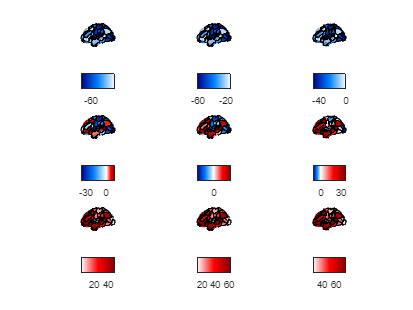</center>


```matlab
figure; plotBrain(lh_verts, lh_faces, Scha17_parcs.lh_scha100, (1:50).'+(-75:12.5:25), 'colormap', @bluewhitered, 'colorscheme', 'global'); c = colorbar; c.Layout.Tile = 'east';
```

<center>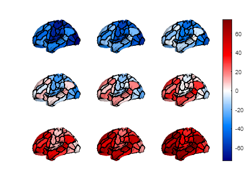</center>


These can also be combined with the <samp>'groupBy'</samp> syntax:

```matlab
figure; [~,~,tl,tl2] = plotBrain(lh_verts, lh_faces, Scha17_parcs.lh_scha100, (1:50).'+(-37.5:12.5:0), 'colormap', @bluewhitered, ...
    'view', {[-90 0], [90 0]}, 'groupBy', 'data', 'titles', {'Map 1', 'Map 2', 'Map 3', 'Map 4'}, 'colorbarOn', true);
```

<center>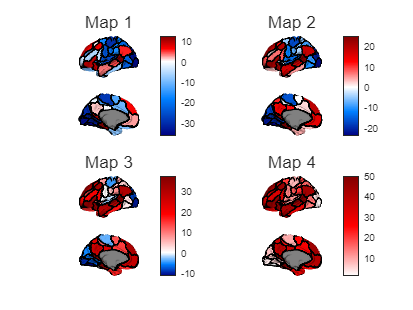</center>

<a name="H_6480F150"></a>
# Titles

You can use the Name-Value argument <samp>'titles'</samp> to input a cell array of titles to be used for each plot or subplot:

```matlab
% For each map
figure; plotBrain(lh_verts, lh_faces, Scha17_parcs.lh_scha100, (1:50).'+(-75:12.5:25), ...
    'colormap', @bluewhitered, 'colorscheme', 'global', 'view', 'll', ...
    'titles', arrayfun(@(x) sprintf('Map %d', x), 1:9, 'UniformOutput', false));
```

<center>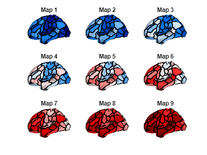</center>


```matlab

% An example when combined with groupBy
figure; [~,~,tl,tl2] = plotBrain(lh_verts, lh_faces, Scha17_parcs.lh_scha100, (1:50).'+(-37.5:12.5:0), 'colormap', @bluewhitered, ...
    'view', {[-90 0], [90 0]}, 'groupBy', 'data', 'titles', {'Map 1', 'Map 2', 'Map 3', 'Map 4'}, 'colorbarOn', true);
```

<center></center>

<a name="H_03317DF2"></a>
# Combining into Larger Figures

You can embed <samp>plotBrain</samp> figures into larger figures by using the <samp>'parent'</samp> Name-Value argument. See <samp>tiledlayout</samp> for more information regarding arrangements in larger figures. 

```matlab
figure; 
tl = tiledlayout(1,2);

[~,~,temp] = plotBrain(lh_verts, lh_faces, Scha17_parcs.lh_scha100, (1:50).'+(-37.5:12.5:0), 'parent', tl, 'colormap', @bluewhitered, 'view', {[-90 0], [90 0]}, 'groupBy', 'data', 'tiledlayoutOptions', {4, 1});
temp.Layout.Tile = 1;
title(temp, {'4 datasets', '2 views'});

[~,~,temp] = plotBrain(lh_verts, lh_faces, Scha17_parcs.lh_scha100, (1:50).'+(-25:25:0), 'parent', tl, 'colormap', @bluewhitered, 'view', {[-135 0], [-45 0], [45 0], [135 0]}, 'groupBy', 'view', 'tiledlayoutOptions', {4, 1});
temp.Layout.Tile = 2;
title(temp, {'2 datasets', '4 views'});
```

<center>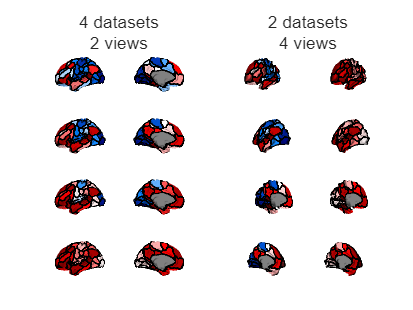</center>

